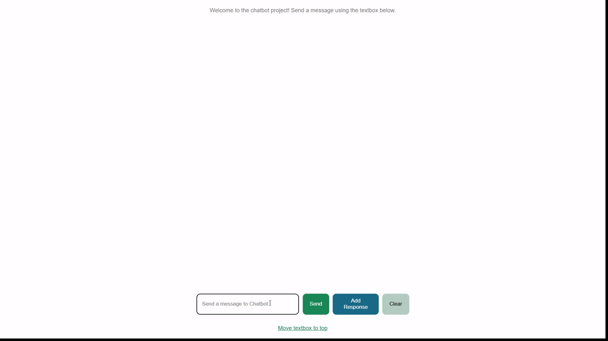
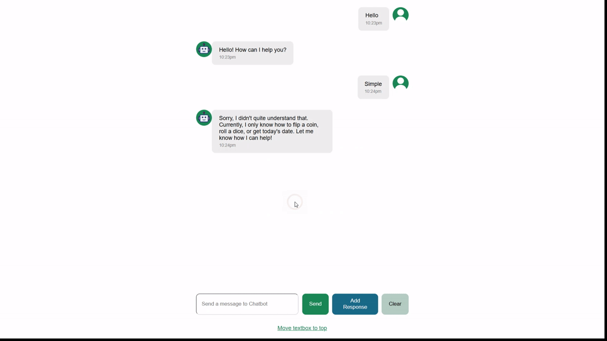

# Chatbot Project

A React chatbot application built while following **SuperSimpleDev's React course**.

The project was developed progressively as part of the course, with the original chatbot functionality and much of the code following the course implementation. I then extended the application with additional features to practice working with React state, keyboard events, modals, portals, and custom chatbot responses.

> **Attribution:** The core project is based on SuperSimpleDev's React course and is not entirely my original work. The additional features described in the **My Additions** section were implemented by me.

## Demo

### Live Demo

> **Coming soon**

[GitHub Pages / Live Demo](#)

### GIFs

> This demo shows how to add a response to a specific prompt.
>



<hr /> <br />

> This demo shows keyboard navigation through previously entered user messages, 
> deletion of message history and verification of the newly added response.
>



## Features

The application provides a simple chatbot interface where users can:

- Send messages to the chatbot.
- Receive asynchronous chatbot responses.
- See loading feedback while waiting for a response.
- Clear the current conversation.
- Navigate through previous user messages.
- Move the chat input between different positions.
- Add custom prompt/response pairs to the chatbot.

## My Additions

### 1. User Message History Navigation

I added keyboard navigation through previously entered user messages.

Pressing:

- `ArrowUp` — moves backwards through previously entered user messages.
- `ArrowDown` — moves forwards through the message history.

This allows users to quickly retrieve and reuse previous prompts without typing them again.

The feature keeps track of the current position in the message history using React state and responds to keyboard events from the chat input.

### 2. Custom Chatbot Responses

I added an **Add Response** button that allows users to define a response for a specific prompt.

The workflow is:

1. Click **Add Response**.
2. A modal opens.
3. Enter the prompt that the chatbot should recognize.
4. Enter the response that should be returned.
5. Click **Add Response** inside the modal.
6. The new prompt/response pair is added to the chatbot's available responses.

The modal is rendered using a **React Portal**, allowing it to be rendered outside the normal component hierarchy.

#### Current Limitation

Custom responses are currently stored only in React state.

Therefore, responses added through the interface are **lost when the page is reloaded**.

This is intentional for the current implementation and could be extended in the future by persisting the custom responses using something such as:

- `localStorage`
- A database
- A backend API

## Technologies & Concepts

While working on this project, I became familiar with:

### React

- Functional components
- Component composition
- Props
- `useState`
- `useEffect`
- Controlled inputs
- Conditional rendering
- Event handling
- Rendering lists

### React Portals

The custom-response modal uses `createPortal()` to render the modal outside the normal component DOM hierarchy.

### State Management

React state is used for:

- Chat messages
- Input text
- Loading state
- Message-history position
- Modal visibility
- Additional chatbot responses

### Browser APIs

The project also uses browser functionality such as:

- `localStorage`
- `crypto.randomUUID()`
- Keyboard events

### Other Technologies

- JavaScript
- React
- React DOM
- Vite
- CSS
- ESLint
- `dayjs`
- `supersimpledev` chatbot library

## Project Structure

```text
chatbot-project/
├── public/
├── src/
│   ├── assets/
│   ├── components/
│   │   ├── chat-input/
│   │   ├── chat-messages/
│   │   └── modals/
│   ├── utils/
│   ├── App.jsx
│   ├── App.css
│   ├── index.css
│   └── main.jsx
├── index.html
├── package.json
├── vite.config.js
└── README.md
```

## Getting Started

### Prerequisites

Make sure you have **Node.js** installed.

The React course recommends Node.js version 20 or higher.

You can check your installed version with:

```bash
node -v
```

### Installation

Clone the repository and navigate to the project:

```bash
git clone <your-repository-url>
cd <repository-name>/chatbot-project
```

Install the dependencies:

```bash
npm install
```

### Start the Development Server

Run:

```bash
npm run dev
```

Vite will provide a local development URL, usually similar to:

```text
http://localhost:5173
```

Open the URL in your browser.

### Build for Production

To create a production build:

```bash
npm run build
```

### Preview the Production Build

```bash
npm run preview
```

### Lint

To run ESLint:

```bash
npm run lint
```

## Possible Future Improvements

Some ideas for future iterations include:

- Persisting custom chatbot responses in `localStorage`.
- Adding the ability to edit or delete custom responses.
- Displaying a list of currently configured custom responses.
- Improving validation in the Add Response form.
- Preventing duplicate prompts.
- Adding timestamps or additional metadata to the message history.
- Adding tests for the custom functionality.
- Improving accessibility for the modal and keyboard navigation.

## Attribution & Learning Context

This project was created while following [SuperSimpleDev's React course](https://github.com/SuperSimpleDev/react-course).

The chatbot project is part of the course material. The original implementation should therefore be attributed to the course rather than presented as entirely original work.

The purpose of this project in my portfolio is to demonstrate my learning process and, in particular, my ability to understand an existing React application and extend it with additional functionality.