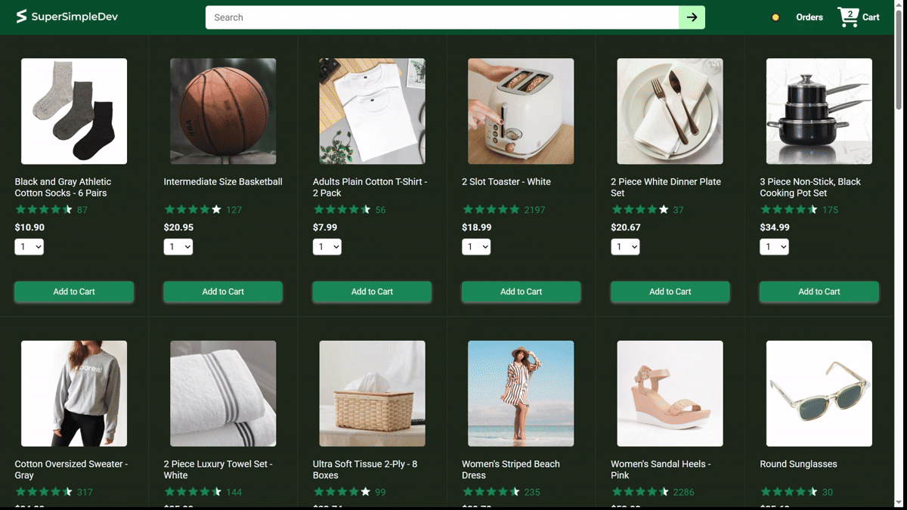
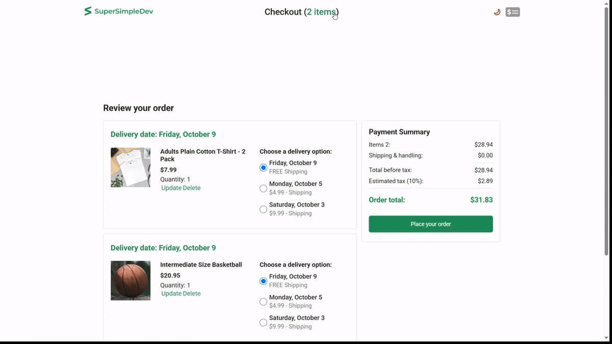

# Ecommerce Project

A React/JavaScript/TypeScript ecommerce application developed while following **SuperSimpleDev's React course**.

The project was built progressively throughout the ecommerce section of the course. The original application structure and most of its functionality follow the course implementation. I extended the project with additional functionality, primarily focusing on React Context, persistent UI preferences, dark-mode styling, and improved navigation.

> **Attribution:** The core ecommerce application is based on SuperSimpleDev's React course and is not entirely my original work. The additional features described in the **My Additions** section were implemented by me.

## Demo


> The demos below show the implementation of the persistent dark mode feauture across all pages,
> and the Scroll-to-Top button
>


<hr /> <br />



## Project Overview

The application is a frontend ecommerce website with functionality for:

- Browsing products
- Searching for products
- Adding products to a cart
- Selecting delivery options
- Viewing payment summaries
- Completing orders
- Viewing previous orders
- Tracking individual products
- Responsive layouts
- Dark mode

The frontend communicates with the ecommerce backend provided as part of SuperSimpleDev's course.

The backend exposes API endpoints for products, delivery options, cart items, orders, payment summaries, and database reset functionality.

## My Additions

### 1. Dark Mode

I added a dark-mode system to the application.

The feature is implemented using a custom React Context:

```text
DarkModeContext
        │
        ▼
DarkModeProvider
        │
        ├── Header
        ├── CheckoutHeader
        ├── Home Page
        ├── Checkout Page
        ├── Orders Page
        └── Tracking Page
```

The header contains a theme-toggle button that allows the user to switch between light and dark modes.

The toggle is available in:

- The main `Header`
- The `CheckoutHeader`

I implemented the dark-mode styling myself, including changes to:

- Background colors
- Text colors
- Borders
- Product cards
- Checkout sections
- Order sections
- Tracking pages
- Other relevant UI elements

### Persistent Dark Mode

The selected theme is persisted using `localStorage`.

This means that if the user enables dark mode and reloads the page, the selected mode remains active.

The relevant state is initialized from `localStorage` and updated whenever the theme changes.

### 2. Scroll-to-Top Button

I added a floating **scroll-to-top** button.

The button:

- Remains hidden while the user is near the top of the page.
- Appears after the user scrolls more than **300px**.
- Uses a scroll event listener to determine whether it should be visible.
- Smoothly scrolls the page back to the top when clicked.
- Removes the scroll listener when the component is unmounted.

This functionality is implemented as a reusable React component:

```text
src/components/ScrollToTopButton.jsx
```

## Technologies & Concepts

This project introduced me to several technologies and React concepts.

### React

- Functional components
- Props
- `useState`
- `useEffect`
- `useContext`
- Controlled components
- Conditional rendering
- Component composition

### React Context

I used React Context to make the dark-mode state available throughout the application without having to pass the state through multiple levels of props.

The main pieces are:

```text
DarkModeContext.jsx
DarkModeProvider.jsx
```

### React Router

The application uses React Router for navigation between pages such as:

- Home
- Checkout
- Orders
- Tracking
- Not Found

### TypeScript

The project uses both React and TypeScript.

I became familiar with:

- Type annotations
- Typed component props
- TypeScript configuration
- `.tsx` files
- Working with JavaScript and TypeScript components in the same application

### REST APIs & Axios

The frontend communicates with the ecommerce backend using Axios.

Examples include requests for:

```text
/api/products
/api/delivery-options
/api/cart-items
/api/orders
/api/payment-summary
```

The complete API is documented by SuperSimpleDev in the [ecommerce backend documentation](https://github.com/SuperSimpleDev/ecommerce-backend-ai/blob/main/documentation.md).

### Testing

The project also contains tests using:

- Vitest
- React Testing Library
- `@testing-library/jest-dom`
- `@testing-library/user-event`
- jsdom

### Other Tools

- Vite
- ESLint
- CSS
- Axios
- Day.js
- Git
- GitHub

## Project Structure

```text
ecommerce-project/
├── public/
│   └── images/
├── src/
│   ├── assets/
│   ├── components/
│   │   ├── Header.tsx
│   │   └── ScrollToTopButton.jsx
│   ├── contexts/
│   │   ├── DarkModeContext.jsx
│   │   └── DarkModeProvider.jsx
│   ├── pages/
│   │   ├── checkout/
│   │   ├── home/
│   │   ├── orders/
│   │   ├── TrackingPage.jsx
│   │   └── NotFoundPage.jsx
│   ├── utils/
│   ├── App.tsx
│   ├── App.css
│   ├── index.css
│   └── main.tsx
├── setupTests.js
├── package.json
├── tsconfig.json
├── vite.config.ts
├── vitest.config.js
└── README.md
```

## Getting Started

The ecommerce project requires **both the frontend and the ecommerce backend** to be running.

The backend used by this project is provided by SuperSimpleDev:

[SuperSimpleDev Ecommerce Backend](https://github.com/SuperSimpleDev/ecommerce-backend-ai)

The backend repository currently specifies Node.js 22+ and uses `npm install` followed by `npm run dev` to start the server.

### Prerequisites

Install:

- Node.js
- npm
- Git

The course uses modern Node.js versions; check the backend repository for its current requirements.

### 1. Set Up the Backend

Clone the ecommerce backend:

```bash
git clone https://github.com/SuperSimpleDev/ecommerce-backend-ai.git
```

Navigate into it:

```bash
cd ecommerce-backend-ai
```

Install its dependencies:

```bash
npm install
```

Start the backend:

```bash
npm run dev
```

The frontend is configured to proxy `/api` requests to:

```text
http://localhost:3000
```

Therefore, the backend should normally be running on port `3000`.

### 2. Set Up the Frontend

Open another terminal and navigate to the ecommerce project:

```bash
cd <repository-name>/ecommerce-project
```

Install the frontend dependencies:

```bash
npm install
```

### 3. Start the Frontend

Run:

```bash
npm run dev
```

Vite will provide a local development URL, usually similar to:

```text
http://localhost:5173
```

Open that URL in your browser.

### Build for Production

```bash
npm run build
```

### Preview the Production Build

```bash
npm run preview
```

### Run Lint

```bash
npm run lint
```

### Run Tests

The project uses Vitest.

Run the test suite with:

```bash
npx vitest
```

For a single test run:

```bash
npx vitest run
```

## Backend API

The frontend communicates with the SuperSimpleDev ecommerce backend.

Some of the main endpoints include:

| Endpoint | Purpose |
|---|---|
| `GET /api/products` | Retrieve products |
| `GET /api/delivery-options` | Retrieve delivery options |
| `GET /api/cart-items` | Retrieve cart items |
| `POST /api/cart-items` | Add an item to the cart |
| `PUT /api/cart-items/:productId` | Update a cart item |
| `DELETE /api/cart-items/:productId` | Remove a cart item |
| `GET /api/orders` | Retrieve orders |
| `POST /api/orders` | Create an order |
| `GET /api/orders/:orderId` | Retrieve an individual order |
| `GET /api/payment-summary` | Retrieve payment information |

For the complete API specification, see the [official backend documentation](https://github.com/SuperSimpleDev/ecommerce-backend-ai/blob/main/documentation.md).

## Possible Future Improvements

Potential future additions include:

- Persisting the shopping cart locally.
- Adding a dedicated theme preference setting.
- Adding more comprehensive tests for the features I implemented.
- Improving accessibility of the theme toggle and scroll-to-top button.
- Adding loading and error states for API requests.
- Adding product filtering and sorting.
- Improving mobile navigation.
- Adding animations for theme transitions.

## Attribution & Learning Context

This project was developed while following [SuperSimpleDev's React course](https://github.com/SuperSimpleDev/react-course).

The ecommerce application, its original functionality, and much of its implementation come from the course. It should therefore **not be presented as an entirely original project**.

My main contribution was extending the existing application with additional functionality, particularly:

- Dark mode
- `DarkModeContext`
- `DarkModeProvider`
- Persistent theme preferences
- Dark-mode styling
- Header theme toggles
- Scroll-to-top functionality

The purpose of including this project in my portfolio is to demonstrate my learning process and my ability to understand and extend a larger React codebase.

